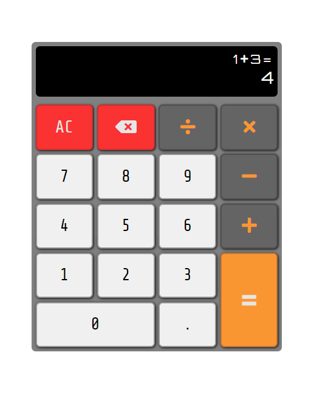

# JavaScript Calculator
 A simple program javaScript calculator, made for FreeCodeCamp certification Project using HTML, CSS, JavaScript and atleast one front-end framework (React, Redux,  Bootstrap, jQuery and/or SASS)

## Usage
 Open the index.html file using a browser to open the app.
 CLick on calculator button to or press the relevent keyboard key to input values or operators.

## Testing
 this project was made using **react** and to test the if the site fulfils all the requirements, you can run the ***test suite*** at the top left and select **JavaScript Calculator** from the dropdown menu and press the *run tests* button, view the results by clicking the button below it which shows how many tests were run.

## Page Preview
 **View/Use this app on Code Pen:** [Drum Machine Live](https://codepen.io/PHULUSO-SINGO/full/gbYoeqd).

 